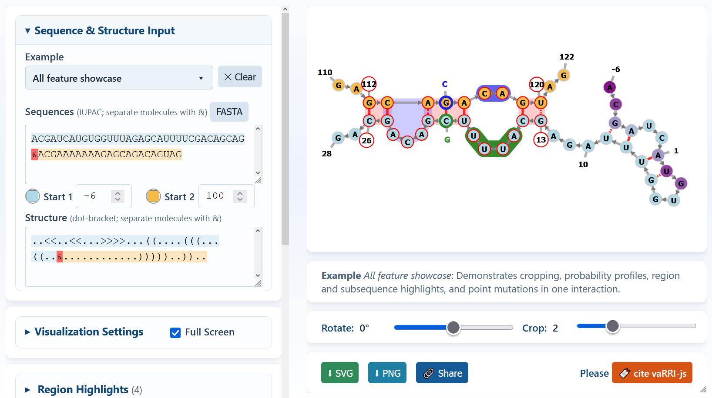

# vaRRI-js - Visual Annotation of RNA–RNA Interactions in JavaScript

Visualise and annotate RNA–RNA interactions directly in the browser — no server, no command-line tools required.

> [!WARNING]
> **AI-Generated Code Disclaimer:** The source code of this project was mainly generated by an AI and
> may contain errors or inaccuracies. It is recommended to review and test the code thoroughly
> before using it in a production environment.

---

## Table of Contents

1. [Overview](#overview-and-objective)
2. [Project Structure](#project-structure)
3. [Quick Start](#quick-start)
4. [Input Website](#input-website)
   - [Usage](#usage)
   - [Sequence and Structure Input Fields](#sequence-and-structure-input-fields)
   - [Example Input](#example-input)
   - [Visualisation Settings](#visualisation-settings)
   - [Subsequence Highlights](#subsequence-highlights)
   - [Probability Profiles](#probability-profiles)
   - [Point Mutations](#point-mutations)
   - [Additional Features](#additional-features)
   - [Export](#export)
5. [URL Parameters & Sharing](#url-parameters--sharing)
   - [Key Parameters](#key-parameters)
6. [Embedding / Web Integration](#-embedding--web-integration)
   - [Query Parameter](#query-parameter)
   - [HTML Example](#html-example)
7. [Input Format Reference](#input-format-reference)
8. [JavaScript Library API](#javascript-library-api)
9. [License](#license)

---

## Overview and Objective

vaRRI-js is a pure JavaScript library to visualize the base pairing of
RNA-RNA interactions (RRIs) as 2D diagrams with additional annotation like 

- coloring by sequence or loop type,
- highlighting of the RRI region,
- subsequence highlightings, 
- point mutation information or 
- probability profile representations.

It is intended to be used in web applications, but can also be used in local HTML files without any server or build step.

Use cases include 

- production of publication-ready RRI figures,
- interactive visualizations of RRI data, 
  - e.g. forwarded from web applications via URL parameters,
- embedding of RRI visualizations in external web pages, e.g. in documentation, blogs, or web tools, and
- educational purposes, e.g. in online courses or tutorials.

Given two sequences and the RRI secondary-structure encoding in dot-bracket notation, vaRRI-js renders
them with the [Fornac](https://github.com/ViennaRNA/fornac) library, and then
applies all of vaRRI's annotations and tweaks.

[](https://backofenlab.github.io/vaRRI-js/)


---

## Project Structure

```
vaRRI-js/
│
├── fornac/
│   ├── fornac.js       # Fornac library (vaRRI dependency)
│   ├── fornac.css      # Fornac styles
│   └── d3.js           # D3.js (fornac dependency)
│
├── src/
│   ├── vaRRI.js        # JavaScript library (vaRRI API)
│   └── README.md       # JavaScript library documentation
├── tests/
│   └── vaRRI.test.js   # Jest unit tests for the vaRRI library
│
├── index.html          # Input website (vaRRI graphical user interface)
├── style.css           # Input website styles
├── index.js            # Input website JavaScript (GUI logic)
│
├── README.md           # Documentation (this file)
└── README.html         # Documentation in HTML format (generated from README.md)
```

---

## Quick Start

The easiest way to [**use vaRRI-js is via the GitHub pages website**](https://BackofenLab.github.io/vaRRI-js): 

- [https://BackofenLab.github.io/vaRRI-js](https://BackofenLab.github.io/vaRRI-js)

If you want to run the website locally or use the library in your own HTML page, clone the repository or download a ZIP of the project via the [Releases](https://github.com/BackofenLab/vaRRI-js/releases) section.
Afterwards, open `index.html` directly in a browser — no build step or server needed:

```bash
git clone https://github.com/BackofenLab/vaRRI-js.git
cd vaRRI-js
# simply open index.html in your browser, e.g.:
open index.html          # macOS
xdg-open index.html      # Linux
start index.html         # Windows
```

To use the library in your own HTML page, include the dependencies in the following order:

```html
<link rel="stylesheet" href="fornac/fornac.css" />
<script src="fornac/d3.js"></script>
<script src="fornac/fornac.js"></script>
<script src="src/vaRRI.js"></script>
```


**NOTE:** The repository does not track `node_modules/`. If you want to run tests locally, create
it after cloning within the project directory using:

```bash
npm install
npm test
```


---

## Input Website

### Usage

1. **Open `index.html`** in a modern browser (Chrome, Firefox, Edge, Safari).
2. The page loads with a pre-filled 2-molecule example automatically.
3. Fill in or modify the fields in the left panel:


### Sequence and Structure Input Fields

| Field | Description |
|---|---|
| **Sequence** | RNA sequence (IUPAC characters). Separate two molecules with `&`. |
| **Start index mol. 1/2** | The number assigned to the first nucleotide of each molecule. Defaults to 1. 0 is not valid; negative indices are supported. |
| **Color Choice** | Use the color pickers to customize the colors for each sequence. |
| **Structure** | Dot-bracket structure string. Separate two molecules with `&`. |

Details about supported sequence and dot-bracket structure encodings are provided in the [Input Format Reference](#input-format-reference) section.

### Example Input

When loading the page, a pre-filled RNA-RNA interaction example is automatically rendered. 
You can also use the respective button to load or unload the example input.

| Button | Description |
|---|---|
| **RNA-RNA interaction** | An RNA-RNA interaction demonstrating all features of vaRRI-js. |
| **X Clear** | Clears all input fields and resets the visualisation. |

Here some example reproductions of figures from the literature:

- *Superfolder GFP reporters validate diverse new mRNA targets of the classic porin regulator, MicF RNA*  (Corcoran et al., 2012) - [DOI](https://doi.org/10.1111/j.1365-2958.2012.08031.x)
  - original figure: [Figure 4A](https://onlinelibrary.wiley.com/doi/10.1111/j.1365-2958.2012.08031.x#f4)
  - reproduction: [vaRRI-js rendering](https://backofenlab.github.io/vaRRI-js/?sequence=AUUCAGGGGUAAAAAGUGA%26UCUGUUUACCCCUAUUU&structure=....%28%28%28%28%28%28%28%28%28......%26....%29%29%29%29%29%29%29%29%29....&startIndex1=-15&startIndex2=47)  


### Visualisation Settings

| Field | Description |
|---|---|
| **Nucleotide color** | `by sequence` — use the defined colors. `by loop type` — Fornac default loop-type coloring. |
| **Highlighting ..** |  |
| **.. RRI Nucleotides** | `region` — highlight all nodes in the entire intermolecular region. `basepairs` — highlight only RRI-basepair nucleotides. `nothing` — no nucleotide highlighting. |
| **.. RRI Background** | `basepairs` — translucent background behind basepairs. `region` — translucent background covering the whole RRI region. `nothing` — no background highlighting. |
| **Base pair color** | Chose the color used for all base pairs (intra- and intermolecular). |
| **Color Choice** | Use the color pickers to customize the highlighting colors. |
| **G-U basepairs dashed** | When checked, G-U basepairs are drawn with a dashed stroke. |
| **Forac force-layout** | When checked, the rendered structure is shown in an interactive force-directed layout. When unchecked, the structure is drawn in a fixed layout. |

### Subsequence Highlights

Add colored highlightings to subsequences of the input sequences via the following fields and use the "Add" button to register them.
All registered highlightings are shown in a list above the input fields, and can be removed by clicking the "🗑️" icon.
Selecting a listed highlighting will populate the input fields with its values for editing.

| Field | Description |
|---|---|
| **Sequence** | The sequence (1 or 2) within which the subsequence is located. |
| **Range** | The start and end indices of the subsequence to highlight in the form `start-end`. |
| **Color** | The color to use for highlighting the subsequence. |

### Probability Profiles

Sometimes no homogenous coloring is desired, but rather a gradient of colors to represent the weight or importance of nucleotides w.r.t. a certain property. 
This can be achieved by providing a probability profile for each molecule, which is a list of numbers between 0 and 1 (inclusive) along with the index of the respective nucleotide.
Such probability profiles can be used to represent e.g.

- the probability of a nucleotide being unpaired, i.e. accessibility for interaction,
- phylogenetic conservation scores of a nucleotide, e.g. from multiple sequence alignments,
- measured or predicted binding probabilities of a nucleotide to a certain ligand, or
- structure probing data, e.g. SHAPE reactivities.

Note, that the probability profiles are not required to sum up to 1, but rather represent a normalized value for each nucleotide.
Furthermore, incomplete probability profiles are supported, i.e. not all nucleotides need to have a value assigned.

The probability profiles are provided in a space-separated CSV format, where each line contains the nucleotide index and the respective probability value.
As separator, either space and tab is supported, and lines starting with `#` are ignored as comments.

```csv
# positions upstream of start codon
-6 0.1
-5 0.5
# start codon
1 0.9
2 0.8
3 0.7
# positions downstream of start codon
4 0.6
23 0.2
```

Finally, the following fields are available to define the visualization of the probability profiles:

| Field | Description |
|---|---|
| **Color** | The color to use for the probability profile. |
| **=1** | When checked, a value of 1 is mapped to the selected color, and a value of 0 is mapped to white. Otherwise, vice versa. |
| **Index wrt.** | `1st nt` — the nucleotide indices in the probability profile are interpreted as relative indices w.r.t. the first nucleotide of the molecule's sequence. `Start` — the nucleotide indices in the probability profile are absolute indices following the indexing defined by the start index of the molecule's sequence. |

*Note:* The indices of the given probability profile are validated against the sequence and start index of the respective molecule, and a warning is shown if any indices are invalid.

### Point Mutations

RNA-RNA interaction visualizations are often used to discuss the effect of point mutations on the interaction. 
To support this, vaRRI-js allows to define point mutations in the input sequences and visualizes them in the rendered structure.
A point mutation is defined by the sequence (1 or 2), the index of the nucleotide to mutate, and the new nucleotide (or letter) to use for the mutation.
This information is provided in the following fields, and the "Add" button registers the mutation.

| Field | Description |
|---|---|
| **Sequence** | The sequence (1 or 2) within which the mutation is located. |
| **Position** | The index of the nucleotide to mutate. |
| **To** | The new nucleotide (or letter) to use for the mutation annotation. |
| **Color** | The color to use for highlighting the mutated nucleotide. |

*Note:* vaRRI-js allows to define arbitrary letters as mutations, i.e. the mutated nucleotide does not need to be a valid IUPAC character.
That way, any kind of annotation can be added to the sequence, e.g. a letter representing a chemical modification, symbols for a certain type of mutation, or even a short word.

All registered mutations are shown in a list above the input fields, and can be removed by clicking the "🗑️" icon.
The list shows the mutations in the standard mutation notation, e.g. `A23G` for a mutation from A to G at position 23, extracting the original nucleotide from the input sequence to avoid mistakes.
Selecting a listed mutation will populate the input fields with its values for editing.


4. Changing selects and checkboxes rerenders immediately. Typed fields rerender when you commit the edit by leaving the field, and single-line inputs also rerender when you press Enter.


### Additional Features

- **Zooming**: Use the mouse wheel to zoom in and out.
- **Panning**: Click and drag the visualisation to pan around. This is useful when zoomed in to focus on a certain region of the structure.
- **Rotation**: Use the *Rotation* slider below the visualisation to rotate the structure. Rotation preserves text orientation and is useful to align the structure for better visibility or to match a certain orientation in a publication figure.
- **Cropping**: Use the *Crop* slider to reduce the unpaired nucleotides at the ends of each sequence to the given number. This is useful to focus on the interaction region and reduce the size of the visualisation. A value of `-1` disables cropping and shows the full sequences.
- **Nucleotide Nodes**
  - .. can be dragged to new positions in the force-directed layout mode.
  - .. show a tooltip with the nucleotide index and probability value (if present) when hovered over.
- **Resize Canvas**: The visualisation canvas size can be adjusted by dragging the bottom-right corner of the canvas. This is useful when visualizing large interactions on large screens, or when preparing figures for publication. The canvas size is preserved when exporting the visualisation.

### Export

After rendering, use the buttons in the export bar below the visualisation:

| Button | Description |
|---|---|
| **⬇ SVG** | Downloads a self-contained SVG file with embedded Fornac CSS. |
| **⬇ PNG** | Rasterises the SVG to a canvas (2× resolution) and downloads a PNG. |
| **🔗 Share Link** | Generate URL encoding of the input for sharing or embedding in other web applications; copied to clipboard. | 

---

Hier ist ein prägnanter, informativer Entwurf für deine `README.md`:

---

## URL Parameters & Sharing

**vaRRI-js** supports state persistence directly via URL parameters, allowing you to pre-fill inputs or share specific visualization configurations using the **🔗 Share Link** button in the export panel. Most parameter names map directly to their corresponding HTML element IDs.

### Key Parameters

In the following, the most important URL parameters are listed with their expected values. 
See descriptions above and the [Input Format Reference](#input-format-reference) section for details on valid input values.

- **`sequence`** – IUPAC nucleotide sequence. Use `&` as a separator for two interacting molecules (*e.g., `GCAUGGCGGGCAA&CCCGCAU`).
- **`structure`** – Secondary structure in dot-bracket notation. Separate two molecules with `&` (*e.g.,   `((...))..<<..&...>>..`).
- **`startIndex1` / `startIndex2`** – Starting sequence indices for strand 1 and strand 2 (default: `1`).
- **`color-seq1` / `color-seq2`** – Custom color hex codes for sequence strands 1 and 2 (*e.g., `%23ff0000` for `#ff0000*`).
- **`coloring`** – Nucleotide color scheme (`strand` or `loop`).
- **`highlighting` / `backgroundhighlighting`** – RRI highlight targets (`region`, `basepairs`, or `nothing`).
- **`color-intermol` / `color-bg` / `color-basepair`** – Hex color codes for nucleotide highlights, background highlights, and base pairs.
- **`guBasepairs`** – Toggle display of G-U Wobble base pairs as dashed lines (`true` / `false`).
- **`animation`** – Enable or disable Fornac force-layout physics simulation (`true` / `false`).

> **NOTE:** 
> - All URL parameters are case-sensitive. 
> - Use proper URL encoding for special characters (e.g., `&` as `%26`, parentheses as `%28` and `%29`) when encoding yourself.


---

## 🔗 Embedding / Web Integration

You can embed the visualization directly into external web pages (e.g., in documentation, blogs, or web tools) using an `<iframe>`.

### Query Parameter

Use the `showRenderingOnly=true` URL parameter to hide all surrounding UI elements (header, controls panel, footer) and display only the visualization result panel.

```text
https://backofenlab.github.io/vaRRI-js/index.html?showRenderingOnly=true&<remaining_parameters...>
```

### HTML Example

```html
<iframe 
  src="https://backofenlab.github.io/vaRRI-js/?sequence=ACGAUCAUGGAUUAGAGCAUUCGACAGCAG%26ACGAAAAAAAGAGCAUACGACAGUAG&color-seq1=%23add8e6&startIndex1=-6&color-seq2=%23f4bb44&startIndex2=100&structure=..%3C%3C%3C%3C...%3E%3E%3E%3E...%28%28..%28%28%28...%28%28..%26............%29%29...%29%29%29..%29%29..&coloring=strand&highlighting=region&color-intermol=%23ff0000&backgroundhighlighting=basepairs&color-bg=%23ff0000&color-basepair=%23ff0000&guBasepairs=on&animation=on&profile-color-1=%23800080&profile-color-1-represents-one=on&profile-color-2=%23ff0000&profile-data-1=%23+unpaired+probabilities%0A1+0.9%0A2+0.7%0A3+0.3%0A4+0.1%0A7+0.3%0A8+0.7%0A9+0.6&profile-idx-ref-1=1&profile-idx-ref-2=1&cropping=2&mutations=1%3A16G%3A338a29%2C2%3A118C%3A338a29&highlights=1%3A18-20%3A338a29%2C2%3A114-116%3A338a29&showRenderingOnly=true" 
  width="100%" 
  height="600" 
  style="border: none;"
  title="vaRRI-js Visualization">
</iframe>
```

> **Note:** Ensure special characters in URL parameters (such as `&` separating two RNA strands) are properly URL-encoded as `%26` when constructing embedding links manually. Also `()` have to be encoded using `%28` and `%29` respectively, as they are not encoded by default by URL encoders following RFC 3986.
Valid embedding links can be generated using the "🔗 Share Link" button in the vaRRI-js interface but have to extended with `&showRenderingOnly=true`.

----

<iframe 
  src="https://backofenlab.github.io/vaRRI-js/?sequence=ACGAUCAUGGAUUAGAGCAUUCGACAGCAG%26ACGAAAAAAAGAGCAUACGACAGUAG&color-seq1=%23add8e6&startIndex1=-6&color-seq2=%23f4bb44&startIndex2=100&structure=..%3C%3C%3C%3C...%3E%3E%3E%3E...%28%28..%28%28%28...%28%28..%26............%29%29...%29%29%29..%29%29..&coloring=strand&highlighting=region&color-intermol=%23ff0000&backgroundhighlighting=basepairs&color-bg=%23ff0000&color-basepair=%23ff0000&guBasepairs=on&animation=on&profile-color-1=%23800080&profile-color-1-represents-one=on&profile-color-2=%23ff0000&profile-data-1=%23+unpaired+probabilities%0A1+0.9%0A2+0.7%0A3+0.3%0A4+0.1%0A7+0.3%0A8+0.7%0A9+0.6&profile-idx-ref-1=1&profile-idx-ref-2=1&cropping=2&mutations=1%3A16G%3A338a29%2C2%3A118C%3A338a29&highlights=1%3A18-20%3A338a29%2C2%3A114-116%3A338a29&showRenderingOnly=true" 
  width="100%" 
  height="600" 
  style="border: 2px solid #333333; border-radius: 6px;"
  title="vaRRI-js Visualization">
</iframe>

----

> **Note:** GitHub repository preview strips embedded `<iframe>` elements as above for security reasons. 
> * If you are viewing this page on **GitHub Pages**, the live widget will render directly below.

## Input Format Reference

### Dot-Bracket Notation

vaRRI-js accepts standard dot-bracket secondary structure notation with the following characters:

| Character | Meaning |
|---|---|
| `.` | Unpaired nucleotide |
| `(` `)` | Basepair (parentheses) |
| `[` `]` | Basepair (square brackets) |
| `{` `}` | Basepair (curly brackets) |
| `<` `>` | Basepair (angled brackets) |
| `&` | Separator between two molecules |

You can use any of the four bracket types to represent basepairs, and they can be nested arbitrarily.  
The only restriction is that the brackets must be balanced, i.e. every opening bracket must have a corresponding closing bracket of the same type.

*Note:* Since vaRRI-js is based on the fornac library, its underlying layout algorithm does not support pseudoknots, i.e. basepairs that cross each other.
In that case, the primary layout will be based on a reduced set of basepairs that do not cross each other, and the remaining basepairs are added subsequently.
Therefore, the layout of pseudoknotted structures may not be optimal, and the visualisation may be less clear than for non-pseudoknotted structures.

### Two-Molecule Input

To encode an RNA-RNA interaction, structures and sequences of both RNA molecules are separated by the `&` character.  

The character positions before `&` belong to molecule 1; positions after `&`
belong to molecule 2.  Intermolecular basepairs are identified automatically
as unmatched brackets: an opening bracket in molecule 1 that has no partner in
molecule 1 is paired to a closing bracket in molecule 2 (and vice-versa).

For example, the following input encodes an RRI where the first molecule has an intra-molecular hairpin in front of the interaction region.:

```
Structure:  ..((((...))))...((...((...((..&............))...))...))..
Sequence:   ACGAUCAGAGAUCAGAGCAUACGACAGCAG&ACGAAAAAAAGAGCAUACGACAGCAG
```

Alternatively, the structure encoding can also be done using different bracket types to distinguish (for the user) between intra- and intermolecular basepairs.:

```
Structure:  ..((((...))))...[[...[[...[[..&............]]...]]...]]..
```

But as discussed, the layout algorithm does not distinguish between different bracket types, and the visualisation will be the same.


### IUPAC Sequence Characters

Accepted characters (case-insensitive):

| Character(s) | Meaning |
|---|---|
| `A` `C` `G` `U` `T` | Standard nucleotides |
| `R` | A or G |
| `Y` | C or T/U |
| `S` | G or C |
| `W` | A or T/U |
| `K` | G or T/U |
| `M` | A or C |
| `B` | C, G or T/U |
| `D` | A, G or T/U |
| `H` | A, C or T/U |
| `V` | A, C or G |
| `N` | Any nucleotide |

*Note:* Using upper- and lower-case letters is supported and can be used to encode and annote certain regions of the sequence, e.g. to distinguish between coding and non-coding regions, or to highlight certain motifs.


### Start Index

Molecule positions are displayed using a 1-based index by default.  You can
change the start index to any integer except 0.  Negative start indices are
supported (e.g. when counting upstream of a start codon).  The start index is used for all
position-based annotations, including highlightings, point mutations, and probability profiles.

---


## JavaScript Library API

Include `src/vaRRI.js` after the Fornac dependencies.  The library exposes a
single global object `vaRRI` with the a set of respective functions.

The `src` directory provides a [detailed vaRRI-js Library API documentation](src/README.md)


---

## License

This project is provided under the MIT License, see [LICENSE](LICENSE) for the licence terms.

The bundled Fornac library ([`fornac/`](fornac/)) is © 2014 Peter Kerpedjiev and is
distributed under its own [licence](fornac/fornac.LICENSE.txt).
